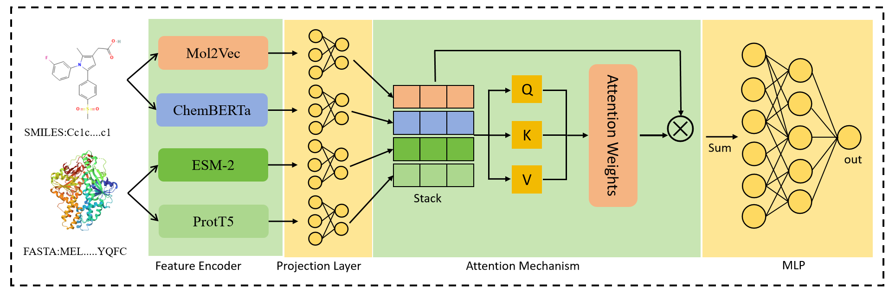

#########
    MCEPDTI: Drug target interaction prediction based on multi-source feature fusion

###Introduction :
    This model aims to predict drug target interactions (DTI) by integrating multimodal features from four pre trained models. Specifically, Mol2vec and ChemBERTa-77M-MLM were used on the drug side, with feature dimensions of 300 and 384, respectively. On the protein side, ESM2.t33_650M.UR50D and ProtT5-XL-U50 were used, with feature dimensions of 1280 and 1024, respectively. The model first projects four feature vectors into a low dimensional semantic space through independent mapping layers, solving the problem of dimensional heterogeneity. Subsequently, an attention mechanism is used to automatically calculate the importance weights of each feature, dynamically evaluate the contribution of different pre trained models, and obtain the fused joint feature representation through weighted summation. Finally, the fused features are input into a multi-layer perceptron (MLP) for binary classification prediction. The entire process can adaptively learn how to integrate multi-source features through end-to-end training, improving the prediction accuracy and robustness of the model.

###Pre trained model download :  
    esm-2 :  pip install fair-esm;  
    mol2vec : https://github.com/samoturk/mol2vec_notebooks/tree/master/Notebooks;  
    ChemBERTa-77M-MLM : https://huggingface.co/DeepChem/ChemBERTa-77M-MLM/tree/main;  
    ProtT5-XL-UniRef50 : https://github.com/agemagician/ProtTrans;

###Dataset :
    Data format: According to the example data in the dataset/Sample_data.csv file.
    Precautions: In the data preprocessing stage, drug and target pre training models are unable to handle certain drug SMILES and protein sequences, so it is necessary to eliminate these unavailable samples and only retain valid drug SMILES and protein sequences.

###model :
    

###requirements :
    python    = 3.8
    torch     = 1.9.0+cu111
    numpy     = 1.24.3
    fair-esm  = 2.0.0
    tqdm      = 4.67.1
    scikit-learn = 1.3.2
    joblib      = 1.4.2
    gensim      = 4.3.3
    pandas      = 2.0.3
    rdkit-pypi  = 2022.9.5
    transformers  = 4.46.3
    sentencepiece = 0.2.0
    protobuf = 4.25.8

###Train the model :
    run code:
        first: data_preprocess.py
        second: main.py

###Use the model:
    run code:
        model_use.py

###Contact :
    We welcome you to contact us (email: 2363955218@qq.com) for any questions and cooperations.
